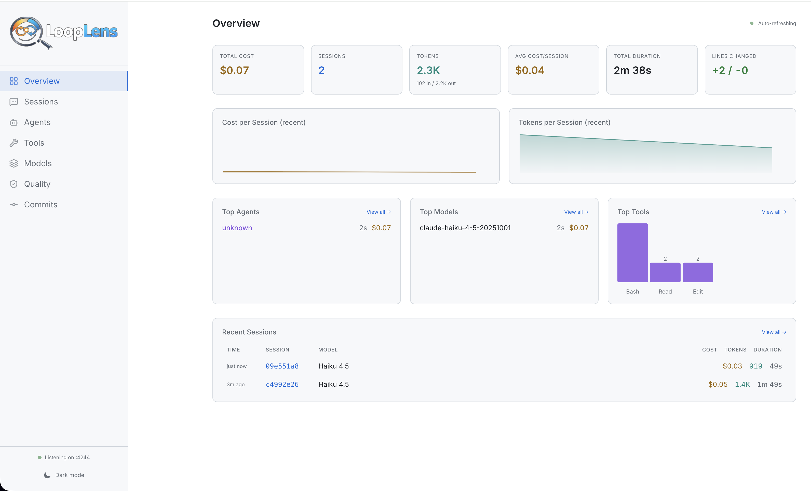

<p align="center">
  
</p>

<p align="center">
  Real-time analytics dashboard for <a href="https://docs.anthropic.com/en/docs/claude-code">Claude Code</a> sessions.<br/>
  Track costs, tokens, tools, models, commits, and quality signals — all in one place.
</p>




---

## Features

| Page | What it shows |
|------|--------------|
|  **Overview** | KPIs (cost, tokens, sessions), cost/token sparklines, top agents, models, tools, recent sessions |
|  **Sessions** | All sessions with model, cost, tokens, duration; click into detail view |
|  **Agents** | Agent breakdown with cost, tokens, and session counts |
|  **Tools** | Tool usage frequency across all sessions |
|  **Models** | Model usage breakdown with cost and token stats |
|  **Quality** | Completion rate, tool error rate, cost/line efficiency, tokens/line, per-session quality table |
|  **Commits** | Claude Code git commits with agent breakdown (cost, tokens per session), linked to sessions |
|  **Insights** *(experimental)* | AI-powered usage analysis — generates a comprehensive HTML report via Claude Code's `/insights` skill |

### Session Detail

Each session includes:
- Cost, token, and duration KPIs
- Agent & environment info
- **Quality signals** — completion status, retry rate, tool error rate, efficiency (¢/line), token efficiency (tok/line), turn count
- Context window and cache usage
- Tool usage chart
- Event timeline
- Session summary (last assistant message)
- **Full conversation transcript** (read from Claude Code's JSONL transcripts)

### Insights (Experimental)

The Insights page uses the Claude Code CLI to generate an AI-powered analysis of your usage history. Click **Generate Insights** to produce a detailed HTML report covering usage patterns, cost breakdowns, and recommendations.

- Requires the **Claude Code CLI** installed on your system
- Generation takes **30–60 seconds** and consumes tokens from your Claude plan
- Report is saved to `~/.claude/usage-data/report.html` and displayed in the dashboard
- Previous reports remain viewable while a new one generates

### Additional Features

- **Light / Dark theme** with localStorage persistence
- **Multi-repo support** — auto-discovers repos from session working directories
- **Agent-only commit filtering** — correlates commits with sessions by timestamp + repo
- **Task label extraction** — derives a human-readable task name from the first user prompt in a session transcript
- **Auto-refresh** — data polls every 5–10 seconds

---

## Architecture

```
┌─────────────────────┐     ┌────────────────────────┐
│   Claude Code       │     │   LoopLens Server      │
│                     │     │  (Express :4244)       │
│  hooks ──HTTP POST──┼────▶│  /api/ingest/hook      │
│  statusline ────────┼────▶│  /api/ingest/statusline│
└─────────────────────┘     │                        │
                            │  SQLite storage:       │
                            │  ~/.looplens/          │
                            └───────┬────────────────┘
                                    │ API
                            ┌───────▼────────────────┐
                            │  React SPA (Vite)      │
                            │  localhost:3001 (dev)  │
                            │  TanStack Query        │
                            │  Tailwind CSS 4        │
                            │  wouter routing        │
                            └────────────────────────┘
```

---

## Quick Start

### Option A: npm (recommended)

```bash
# Install globally
npm install -g looplens

# Set up Claude Code hooks & statusline
looplens install

# Start the dashboard
looplens
```

Or run directly without installing:

```bash
npx looplens
```

Open **http://localhost:4244** — that's it!

### Option B: From source

```bash
git clone https://github.com/jotaku/looplens.git
cd looplens
npm install
npm run prod
```

### Setting up Claude Code integration

If you used `looplens install`, hooks and statusline are configured automatically.

For **manual setup**, add these hooks to `~/.claude/settings.json`:

```json
{
  "hooks": {
    "SessionStart": [
      {
        "type": "http",
        "url": "http://localhost:4244/api/ingest/hook?event=SessionStart"
      }
    ],
    "PostToolUse": [
      {
        "type": "http",
        "url": "http://localhost:4244/api/ingest/hook?event=PostToolUse"
      }
    ],
    "Stop": [
      {
        "type": "http",
        "url": "http://localhost:4244/api/ingest/hook?event=Stop"
      }
    ],
    "StopFailure": [
      {
        "type": "http",
        "url": "http://localhost:4244/api/ingest/hook?event=StopFailure"
      }
    ],
    "SessionEnd": [
      {
        "type": "http",
        "url": "http://localhost:4244/api/ingest/hook?event=SessionEnd"
      }
    ]
  }
}
```

For real-time cost/token data, add the statusline:

```json
{
  "statusLine": {
    "command": "~/.claude/plugins/looplens/scripts/statusline.sh"
  }
}
```

---

## API Reference

### Ingest

| Method | Endpoint | Description |
|--------|----------|-------------|
| `POST` | `/api/ingest/hook?event=<name>` | Receive Claude Code hook events |
| `POST` | `/api/ingest/statusline` | Receive statusline JSON updates |

### Read

| Method | Endpoint | Description |
|--------|----------|-------------|
| `GET` | `/api/stats` | Aggregate KPIs (cost, tokens, sessions, models, tools) |
| `GET` | `/api/stats/quality` | Aggregate quality signals across all sessions |
| `GET` | `/api/sessions?page=N&limit=N` | Paginated session list |
| `GET` | `/api/sessions/:id` | Session detail + events + quality signals |
| `GET` | `/api/sessions/:id/transcript` | Conversation transcript from Claude Code JSONL |
| `GET` | `/api/commits?page=N&limit=N` | Claude Code git commits correlated with sessions |

### Insights

| Method | Endpoint | Description |
|--------|----------|-------------|
| `GET` | `/api/insights/status` | Check CLI availability, report existence, generation state |
| `POST` | `/api/insights/generate` | Start AI-powered insights report generation |
| `GET` | `/api/insights/report` | Serve the generated HTML report |

### Management

| Method | Endpoint | Description |
|--------|----------|-------------|
| `POST` | `/api/reset` | Clear all stored data |
| `GET` | `/api/health` | Server health check |

---

## Data Storage

All data is stored in a single SQLite database at `~/.looplens/analytics.db`:

- **`sessions` table** — session metadata, cost, tokens, tools, model info, task label
- **`events` table** — hook event timeline with indexed lookups by session and timestamp
- **WAL mode** enabled for safe concurrent reads/writes from parallel Claude Code sessions
- **Schema migrations** run automatically on startup (e.g. adding new columns to existing databases)

Transcripts are read directly from Claude Code's project files at `~/.claude/projects/`.
Task labels are extracted from the first user prompt in each session's transcript.

---

## Tech Stack

- **Backend**: Express 5, TypeScript, tsx
- **Frontend**: React 19, Vite 6, Tailwind CSS 4, TanStack Query 5, wouter 3
- **Icons**: [Lucide](https://lucide.dev) via lucide-react
- **Font**: [Inter](https://fonts.google.com/specimen/Inter) (Google Fonts)
- **Storage**: SQLite via [better-sqlite3](https://github.com/WiseLibs/better-sqlite3) (single file, no external services)
- **Testing**: [Vitest](https://vitest.dev)

---

## Development

```bash
# Terminal 1: Backend with auto-reload
npm run dev:server

# Terminal 2: Frontend with HMR
npm run dev

# Run tests
npm test

# Run tests in watch mode
npm run test:watch

# Type check
npx tsc --noEmit

# Build for production
npm run build
```

---

## License

MIT — see [LICENSE](LICENSE) for details.
